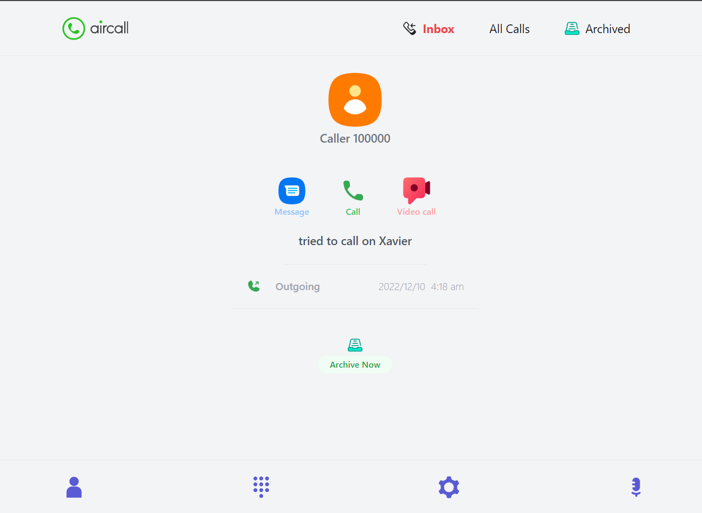

# Speer-AirCall
A call management app for Aircall.

## Demo link:
Access the deployed project at [Speer-frontend](https://speertechnologies-frontend.vercel.app/)

## Table of Content:

- [About The App](#about-the-app)
- [Screenshots](#screenshots)
- [Technologies](#technologies)
- [Setup](#setup)
- [Approach](#approach)
- [Status](#status)

## About The App
[Speer-Aircall] offers a comprehensive solution to efficiently handle and organize call records. It features a user-friendly interface that allows users to seamlessly navigate through different sections, including the complete call list, the inbox, and archived calls. 

By simply clicking on any call entry, users can view in-depth details of the call, including the duration, caller information, and call status. This functionality provides a thorough insight into call activities, making it an indispensable tool for effective call management.

## Screenshots

## Technologies
I used `React` for the frontend, with additional libraries - `recoil` for state management, `react-router-dom` for routing, and `TaiwindCSS` for styling.

## Setup
- Clone the repository
- run `npm install`
- run `npm run dev`

## Approach
I adopted the `BEM` naming style for my css class names and ...

